<div align="center">

# 📅 Employee Shift Scheduling Optimization Engine (Amazon Shift Optimizer)

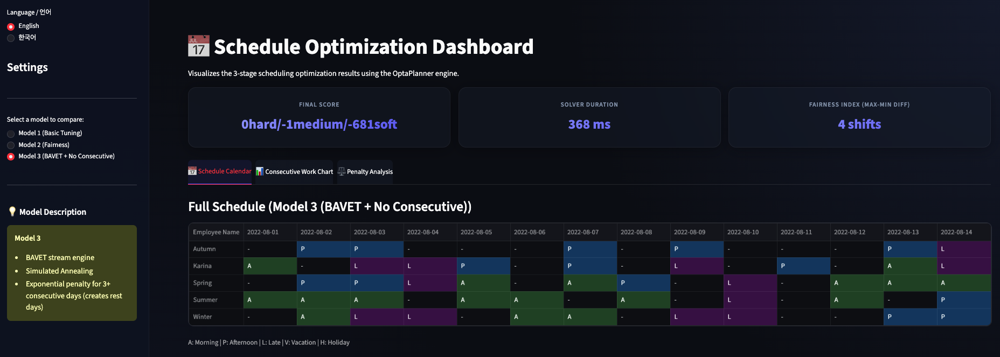

<br>

A premium employee shift scheduling optimization engine built on **OptaPlanner (BAVET Constraint Stream + Simulated Annealing)** and visualized with a **Streamlit Dashboard**. This project solves the complex NP-Hard problem of workforce scheduling, ensuring complete satisfaction of business requirements while guaranteeing fairness and preventing employee burnout.

</div>

---

## 🌟 Streamlit Optimization Dashboard

Traditional optimization engines often operate as 'black boxes', where the internal decision-making process is hidden. To solve this, we built an interactive **Streamlit dashboard** in Python to visualize the engine's logical workflow.

This dashboard allows administrators to perform real-time comparative analysis across different optimization models (Model 1, 2, 3). By evaluating broken constraints, penalty scores, and execution times, users can intuitively understand exactly *why* a specific schedule was selected as the optimal result.

**Key Features:**
- **Dynamic Schedule Calendar:** A color-coded view organized by shift times: Morning (M), Afternoon (A), and Late (L).
- **Fairness Index Tracking:** Quantifies and monitors the gap in total shifts assigned among employees.
- **Multi-language Support:** Easy toggling between English and Korean UI.

---

## 🚀 Model 3 Performance & Results (Final Version)

**Model 3** is the most powerful and advanced optimization engine in this project. By combining the latest BAVET stream processing engine with a Metaheuristic algorithm (Simulated Annealing), it goes beyond simply filling headcount—it guarantees the **Quality of Life** of the employees.

### 1. Optimal Schedule Generation
<p align="center">
  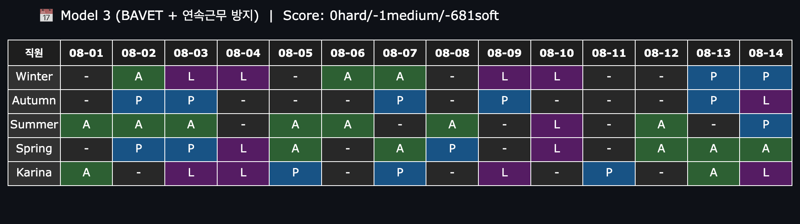
</p>

> **Result Analysis:** The final generated schedule. The blank spaces represent days off. The engine perfectly balances individual time-off requests, holidays, and the mandatory shift coverage (M/A/L) required by the hospital/store. It doesn't just fill empty slots; it intelligently assigns shifts based on each employee's unique skill set.

### 2. Burnout & Fatigue Prevention (Consecutive Workday Control)
<p align="center">
  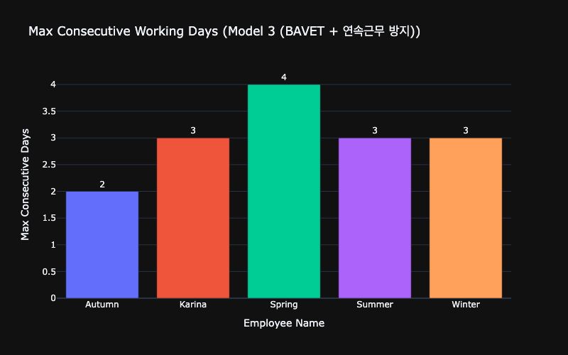
</p>

> **Result Analysis:** This chart tracks the maximum consecutive working days for each employee. Standard optimization models often have the fatal flaw of assigning 5 to 6 consecutive shifts to certain employees when short-staffed. In stark contrast, **Model 3 strictly limits the maximum consecutive working days to 3-4 days per employee**. It forcefully injects 'stepping-stone' rest days between consecutive shifts, fundamentally preventing employee burnout and overwork.

### 3. Constraint Penalty Analysis
<p align="center">
  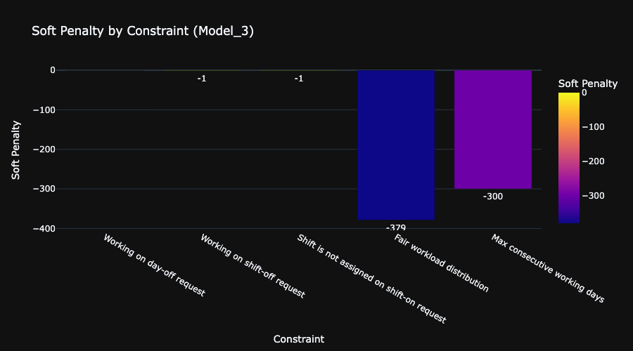
</p>

> **Result Analysis:** A truly "perfect" schedule practically does not exist (NP-Hard). Granting all time-off requests leads to understaffing, while forcing coverage leads to consecutive workdays. The engine systematically imposes **Penalties** for specific rule violations (e.g., ignoring time-off requests, unfair workload distribution). The chart above shows the inevitable penalties incurred in the final schedule. Adjusting the weight of these *Soft Penalties* is the key mechanism that guides the algorithm to create the most 'human-centric' schedule.

---

## ⚙️ Model Architecture & Data Flow

How does the engine find the absolute best schedule among tens of millions of combinations in under a minute? Here is the mathematical and structural mechanism.

### 1. System Data Flow
<p align="center">
  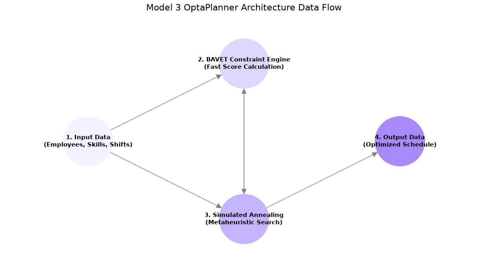
</p>

> **Technical Deep-Dive:** 
> Initial input data (Employees, Skills, Shifts) is fed into the **BAVET Constraint Engine**. The defining feature of BAVET is **Incremental Calculation**. When a single shift changes, it does not recalculate the entire schedule's score. Instead, it ultra-fast updates only the score of the affected parts.
> Based on this lightning-fast evaluation, the **Simulated Annealing** heuristic algorithm continuously explores thousands of schedule permutations, repeating the feedback loop until the Global Optimum is found.

### 2. Simulated Annealing Optimization Process
<p align="center">
  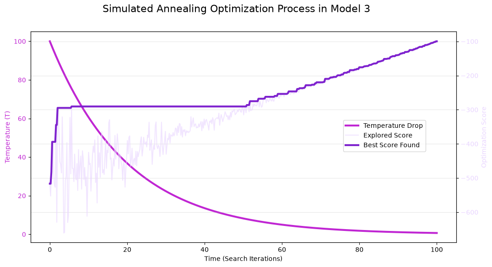
</p>

> **Technical Deep-Dive:** 
> Inspired by the metallurgy process of heating and slowly cooling metal to increase its strength. As the search progresses, the algorithm's **Temperature (Magenta line)** gradually drops.
> - **Early Stage (High Temperature):** If the algorithm only accepts better schedules, it gets trapped in Local Optima. Thus, early on, it probabilistically accepts *worse* schedules (Light Purple line) to explore a wider search space.
> - **Late Stage (Low Temperature):** As it cools, the algorithm becomes strict. It only accepts schedules that are undeniably better than the past (Deep Purple line), eventually converging on the single most ideal schedule.

---

## 📈 Evolution of the Models (Baselines)

A history of how the engine evolved and solved problems from its early baseline versions to the current Model 3.

### 🛑 Model 1 (Basic Search Model)
The initial model using only the Tabu Search algorithm without any fairness constraints. It only cared about filling the required headcount.
<div align="center">
  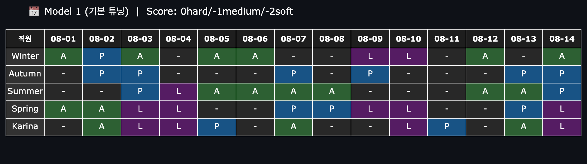<br><br>
  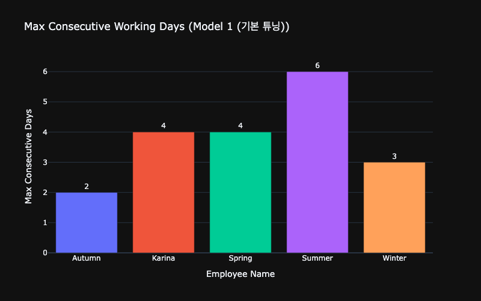
  <p><em>⚠️ <b>Issue:</b> Workloads were extremely skewed toward a few employees, resulting in <b>up to 6 consecutive days of overwork without a single day off</b>. This schedule was completely unusable in a real-world work environment.</em></p>
  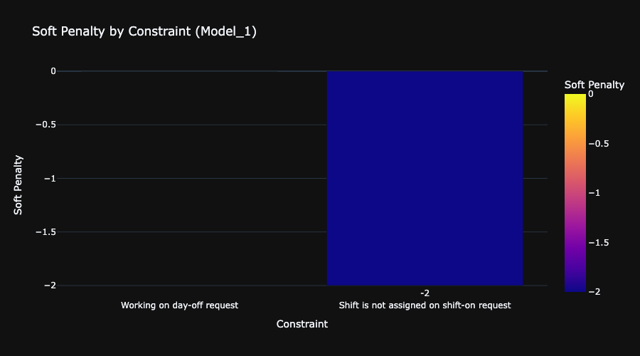
  <p><em>It only avoided hard constraints (filling headcount) and completely lacked flexible soft penalty controls for employee fatigue or requested time-offs.</em></p>
</div>

### ⚠️ Model 2 (Workload Fairness Model)
An improvement attempt to solve Model 1's issues. It applied a Squared Penalty to the total number of shifts to evenly distribute the total workload among employees.
<div align="center">
  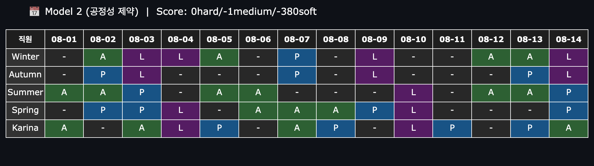<br><br>
  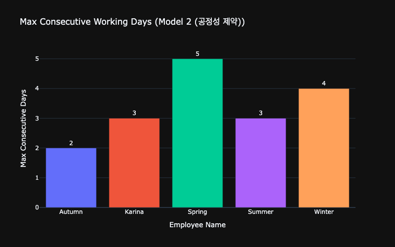
  <p><em>⚠️ <b>Issue:</b> The 'total workload' for the month was fairly distributed. However, it failed to prevent work from bunching up in a specific week, meaning the <b>short-term burnout issue of 5+ consecutive working days</b> was completely unresolved.</em></p>
  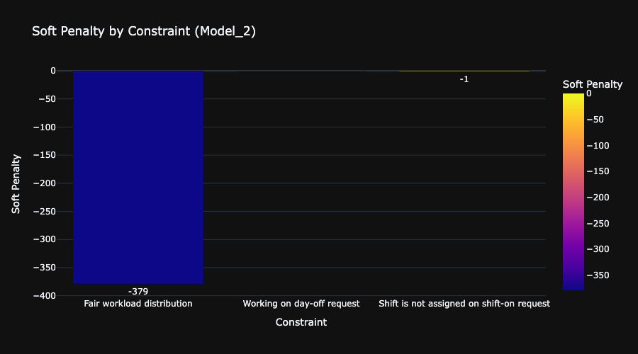
  <p><em>While the penalty score for workload disparity was optimized, there was no qualitative optimization logic for *when* and *how* to place rest days. Model 3 was born to overcome this exact limitation.</em></p>
</div>

---

## 📂 Project Structure

```text
.
├── infra/                  # AWS CDK code for cloud resource deployment (IaC)
├── opt_engine/             # Core Optimization Engine Logic
│   ├── apps/               # Spring Boot / Quarkus REST API for OptaPlanner integration
│   ├── core/               # Domain Models, Entities, and Constraint definitions
│   └── streamlit_app/      # Python Streamlit Dashboard frontend & Jupyter Notebooks for analysis
└── README.md
```

---

## 📚 References & Data Sources

- **Core Optimization Engine:** [OptaPlanner Documentation](https://www.optaplanner.org/learn/documentation.html) (Currently migrating to Timefold)
- **Dashboard & Visualization:** Python open-source framework [Streamlit](https://streamlit.io/) and interactive charting library [Plotly](https://plotly.com/)
- **Cloud Infrastructure Architecture:** Infrastructure as Code via [AWS Cloud Development Kit (CDK)](https://aws.amazon.com/cdk/)
- **Applied Algorithms:** Metaheuristics (Simulated Annealing, Tabu Search), BAVET Constraint Streams
